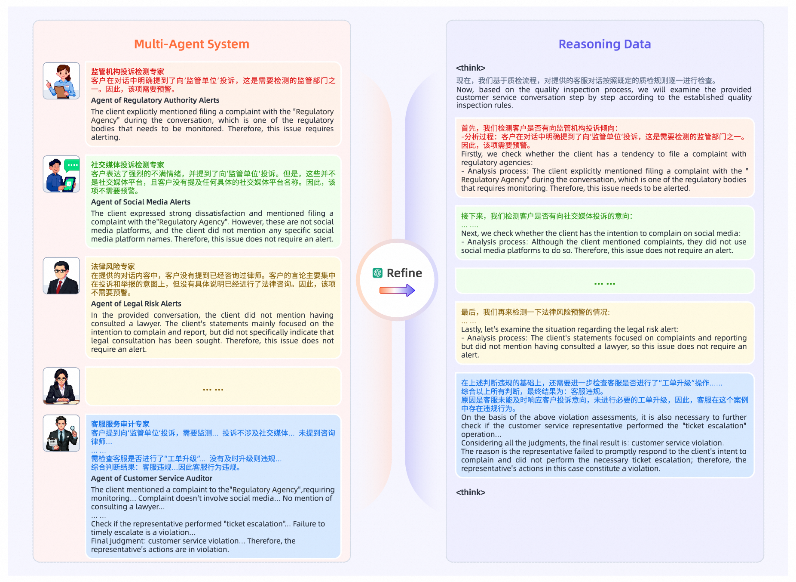
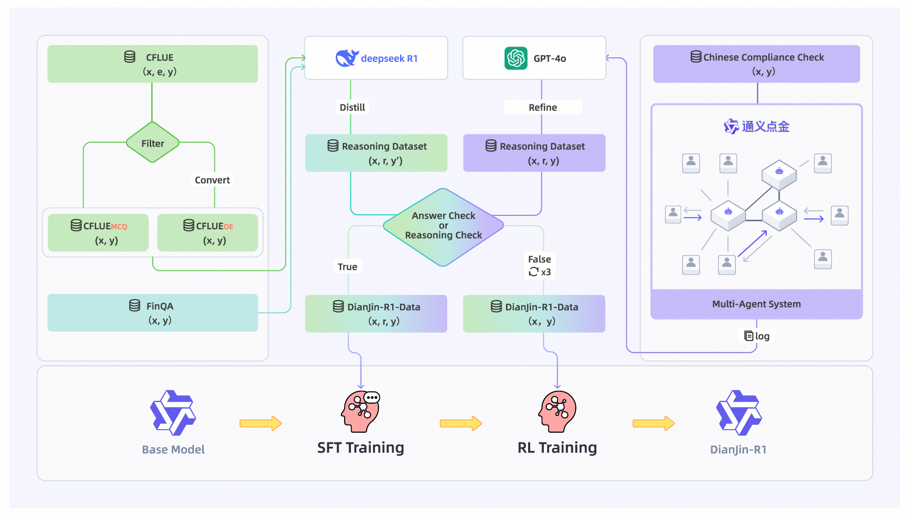

<div align="center">
    <h1><b>DianJin-R1</b></h1>
    <p>
    <b>A large reasoning model for the financial domain</b>
    </p>

[](https://arxiv.org/abs/2504.15716)
[](https://github.com/aliyun/qwen-dianjin)
[](https://huggingface.co/DianJin)
[](https://modelscope.cn/organization/tongyi_dianjin)
[](https://huggingface.co/DianJin)
[](https://modelscope.cn/organization/tongyi_dianjin)

[**中文**](README_zh.md) | **EN**

</div>

## Table of Contents
- [Introduction](#summary)
- [Dataset/Model Download](#download)
- [Reasoning Dataset](#dataset)
- [Two-stage Training](#2step)
    - [Stage 1: Learning Reasoning with SFT](#step1)
    - [Stage 2: Enhancing Reasoning with RL](#step2)
- [Model Evaluation](#eval)
    - [Merge & Deploy](#merge_and_deploy)
    - [Inference & Evaluation](#infer_and_eval)
- [License](#license)
- [Citation](#cite)

## 📢 Introduction<a name="summary"></a>

Effective reasoning remains a core challenge for large language models (LLMs) in the financial domain, where tasks often require domain-specific knowledge, precise numerical calculations, and strict adherence to compliance rules. We propose DianJin-R1, a reasoning-enhanced framework designed to address these challenges through reasoning-augmented supervision and reinforcement learning. Central to our approach is DianJin-R1-Data, a high-quality dataset constructed from CFLUE, FinQA, and a proprietary compliance corpus (Chinese Compliance Check, CCC), combining diverse financial reasoning scenarios with verified annotations. Our models, DianJin-R1-7B and DianJin-R1-32B, are fine-tuned from Qwen2.5-7B-Instruct and Qwen2.5-32B-Instruct using a structured format that generates both reasoning steps and final answers. To further refine reasoning quality, we apply Group Relative Policy Optimization (GRPO), a reinforcement learning method that incorporates dual reward signals: one encouraging structured outputs and another rewarding answer correctness. We evaluate our models on five benchmarks: three financial datasets (CFLUE, FinQA, and CCC) and two general reasoning benchmarks (MATH-500 and GPQA-Diamond). Experimental results show that DianJin-R1 models consistently outperform their non-reasoning counterparts, especially on complex financial tasks. Moreover, on the real-world CCC dataset, our single-call reasoning models match or even surpass the performance of multi-agent systems that require significantly more computational cost. These findings demonstrate the effectiveness of DianJin-R1 in enhancing financial reasoning through structured supervision and reward-aligned learning, offering a scalable and practical solution for real-world applications.


## 📥 Dataset/Model Download<a name="download"></a>

|               |                         ModelScope                         |               HuggingFace                |
|:---------------:|:----------------------------------------------------------:|:----------------------------------------:|
| DianJin-R1-Data | [Data](https://modelscope.cn/organization/tongyi_dianjin)  | [Data](https://huggingface.co/DianJin/)  |
|  DianJin-R1-7B  | [Model](https://modelscope.cn/organization/tongyi_dianjin) | [Model](https://huggingface.co/DianJin/) |
| DianJin-R1-32B  | [Model](https://modelscope.cn/organization/tongyi_dianjin) | [Model](https://huggingface.co/DianJin/) |


## 🔧 Reasoning Dataset<a name="dataset"></a>

<table>
<thead>
<tr>
<th>Dataset</th>
<th>Language</th>
<th>Size</th>
<th>Q_token</th>
<th>R_token</th>
<th>A_token</th>
</tr>
</thead>
<tbody>
<tr>
<td colspan="6" align="center">Used in SFT</td>
</tr>
<tr>
<td>CFLUE_{MCQ}</td>
<td>Chinese</td>
<td>26672</td>
<td>134.85</td>
<td>807.42</td>
<td>95.71</td>
</tr>
<tr>
<td>CFLUE_{OE}</td>
<td>Chinese</td>
<td>5045</td>
<td>49.28</td>
<td>857.04</td>
<td>485.60</td>
</tr>
<tr>
<td>FinQA</td>
<td>English</td>
<td>4581</td>
<td>1048.38</td>
<td>1576.91</td>
<td>148.42</td>
</tr>
<tr>
<td>CCC</td>
<td>Chinese</td>
<td>1800</td>
<td>1695.78</td>
<td>884.29</td>
<td>69.64</td>
</tr>
<tr>
<td colspan="6" align="center">Used in RL</td>
</tr>
<tr>
<td>CFLUE_{MCQ}</td>
<td>Chinese</td>
<td>4096</td>
<td>132.40</td>
<td>-</td>
<td>2.15</td>
</tr>
</tbody>
</table>

For the CFLUE dataset, we first use gpt-4o to convert multiple-choice questions into open-ended questions, then utilize deepseek-r1 to obtain reasoning data. Please refer to [our paper](https://arxiv.org/abs/2504.15716) for details.

For the FinQA dataset, which consists of open-ended questions by default, no additional conversion is required. Other processing steps are consistent with those used for CFLUE.

For the CCC dataset, we collect all reasoning steps from the multi-agent LLM system and combine them into a final, unified reasoning process and result using gpt-4o.



## 🔄 Two-stage Training<a name="2step"></a>



### Stage 1: Learning Reasoning with SFT<a name="step1"></a>

#### Envorinment Setup

We use the [LLaMA-Factory](https://github.com/hiyouga/LLaMA-Factory) framework for SFT training. Please install the following dependencies:
```shell
conda create -n llama python==3.10 -y
conda activate llama
git clone https://github.com/hiyouga/LLaMA-Factory.git
cd LLaMA-Factory
pip install -e .
pip install deepspeed==0.15.4
pip install vllm==0.8.2
```

#### Training（Using Qwen2.5-7B-Instruct as an Example）
```shell
cd src/sft
bash sft.sh
```

### Stage 2: Enhancing Reasoning with RL<a name="step2"></a>
#### Environment Setup

We use the [verl](https://github.com/volcengine/verl) framework for GRPO training. Please install the following dependencies:
```shell
conda create -n verl python==3.10 -y
conda activate verl
git clone https://github.com/volcengine/verl.git
cd verl
pip install -e .
pip install flash-attn --no-build-isolation
pip install vllm==0.8.2
```

#### Reward Function

A score of 1 is given if the format is correct and the answer is accurate;
otherwise, the score is 0. For details, please refer to `rl/reward_score_cflue.py`.

#### Training（Using Qwen2.5-7B-Instruct as an Example）

```shell
cd src/rl
bash grpo.sh
```

## 📊 Model Evaluation<a name="eval"></a>

<table>
<thead>
<tr>
<th rowspan="2">Model</th>
<th colspan="3" align="center">Financial</th>
<th colspan="2" align="center">General</th>
<th rowspan="2">Avg.</th>
</tr>
<tr>
<th>CFLUE</th>
<th>FinQA</th>
<th>CCC</th>
<th>MATH</th>
<th>GPQA</th>
</tr>
</thead>
<tbody>
<tr>
<td colspan="7" align="center">General models without explicit reasoning</td>
</tr>
<tr>
<td>GPT-4o</td>
<td>71.68</td>
<td>79.16</td>
<td>50.00</td>
<td>77.93</td>
<td>39.56</td>
<td>63.67</td>
</tr>
<tr>
<td>DeepSeek-V3</td>
<td>75.14</td>
<td><b>81.34</b></td>
<td>57.50</td>
<td>87.20</td>
<td>45.45</td>
<td>68.33</td>
</tr>
<tr>
<td>Qwen2.5-7B-Instruct</td>
<td>69.37</td>
<td>66.70</td>
<td>55.00</td>
<td>71.40</td>
<td>33.84</td>
<td>59.26</td>
</tr>
<tr>
<td>Qwen2.5-32B-Instruct</td>
<td>77.95</td>
<td>79.51</td>
<td>56.50</td>
<td>81.00</td>
<td>44.95</td>
<td>67.98</td>
</tr>
<tr>
<td>Qwen2.5-72B-Instruct</td>
<td>79.46</td>
<td>77.94</td>
<td>55.50</td>
<td>82.20</td>
<td>39.90</td>
<td>67.00</td>
</tr>
<tr>
<td colspan="7" align="center">General models with reasoning </td>
</tr>
<tr>
<td>DeepSeek-R1</td>
<td><ins>86.64</ins></td>
<td>79.81</td>
<td>67.50</td>
<td><ins>94.80</ins></td>
<td><b>66.16</b></td>
<td><ins>78.98</ins></td>
</tr>
<tr>
<td>DeepSeek-R1-Distill-Qwen-7B</td>
<td>48.39</td>
<td>66.09</td>
<td>41.50</td>
<td>90.20</td>
<td>45.96</td>
<td>58.43</td>
</tr>
<tr>
<td>DeepSeek-R1-Distill-Qwen-14B</td>
<td>70.83</td>
<td>76.63</td>
<td>50.00</td>
<td>93.20</td>
<td>54.55</td>
<td>69.04</td>
</tr>
<tr>
<td>DeepSeek-R1-Distill-Qwen-32B</td>
<td>78.52</td>
<td>77.00</td>
<td>52.00</td>
<td><b>95.00</b></td>
<td><ins>63.64</ins></td>
<td>73.23</td>
</tr>
<tr>
<td>QwQ-32B</td>
<td>83.49</td>
<td>78.38</td>
<td>52.00</td>
<td><b>95.00</b></td>
<td><ins>63.64</ins></td>
<td>74.50</td>
</tr>
<tr>
<td colspan="7" align="center">DianJin-R1 with reasoning</td>
</tr>
<tr>
<td>DianJin-R1-7B</td>
<td>80.32</td>
<td>77.72</td>
<td><ins>94.50</ins></td>
<td>76.60</td>
<td>37.54</td>
<td>73.34</td>
</tr>
<tr>
<td>DianJin-R1-32B</td>
<td><b>86.74</b></td>
<td><ins>80.82</ins></td>
<td><b>96.00</b></td>
<td>88.20</td>
<td>58.59</td>
<td><b>82.07</b></td>
</tr>
</tbody>
</table>


#### Merge & Deploy<a name="merge_and_deploy"></a>


We need to merge the FSDP-trained model into the HuggingFace format and deploy it using VLLM for fast inference.

```shell
cd src/evaluate
# merge model
python3 merge_model.py --fsdp_path <ckpt path after GRPO> --hf_path <base model path> --out_path checkpoints/Qwen2.5-7B-Instruct-GRPO
# deploy model 
bash run_vllm.sh
```

#### Inference & Evaluation<a name="infer_and_eval"></a>

- CFLUE & FinQA

The relevant code is stored in `src/evaluate/eval.py`, where `eval_cflue` and `eval_finqa` are used to evaluate the CFLUE, FinQA datasets respectively.

```shell
# Evaluation example
cd src/evaluate
python3 eval.py --result_path <result path>
```

- MATH & GPQA

Please refer to [EvalScope](https://github.com/modelscope/evalscope) for evaluating MATH and GPQA-Diamond.

## 📋 License<a name="license"></a>

This project adheres to [MIT License](https://lbesson.mit-license.org/).

## 🔖 Citation<a name="cite"></a>

If you use our model or dataset, please cite our paper.

```
@article{dianjin-r1,
    title   = {DianJin-R1: Evaluating and Enhancing Financial Reasoning in Large Language Models}, 
    author   = {Jie Zhu, Qian Chen, and Huaixia Dou, Junhui Li, Lifan Guo, Feng Chen, and Chi Zhang},
    journal = {arxiv.org/abs/2504.15716},
    year    = {2025}
}
```
